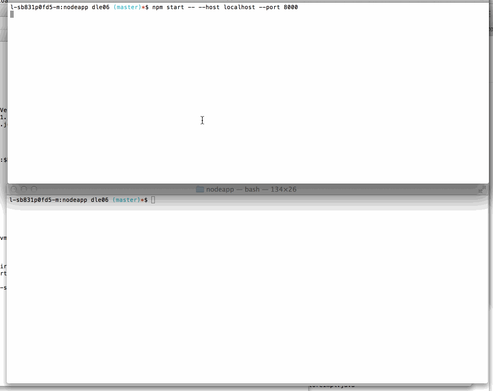

### This is the Echo Server project

#### Starting the server

```
npm install
bodemon index.js  [options]
```


####Options

```
--host - destination server or echo server
--port - default to 8000 if 127.0.0.1, otherwise, 80
--log  - log to a specified file
--url  - echo from content of url specified

```


#### Demo

